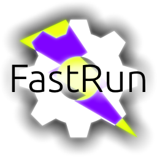

<div style="text-align: center;">



# FastRun

Ultra fastly run your favourite programs from any place

[Русская версия](README.ru.md)&emsp;/&emsp;[What is this?](#what-is-this) / [Installation and configuration](#installation-and-configuration) / [License](#license) / [Thanks to](#thanks-to) / [Contact me](#contact-me)

</div>

# What is this?

FastRun is a very small but useful utility for Windows. It allows to execute your favourite programs, URLs, files, directories and other stuff from any place like Command Prompt (CMD), "Run" window (Win + R), etc.\
FastRun is a 100% portable program. No need to install program - just download and run!

### *FastRun is developed by me for my personal purposes, but if you find this stuff worths it, I will be very pleased :3*

**WARNING!** FastRun requires .NET Framework 4.7.2 to be installed. FastRun probably will NOT work under Windows XP and older OSes (we are not sure even about Wine under non-Windows).

# How to use?

* Download the latest version from "Releases" page
* Extract downloaded ZIP archive to any folder
* Open there Command Prompt (CMD) or Windows PowerShell and execute this command:
```frun --install```
* Set up the program

FastRun usually works from console and supports these commands (command-line arguments)

* --settings
  Set up FastRun (too few settings at the moment, sorry)
* --add
  Add new item to FastRun list
* --remove
  Remove item from FastRun list
* --clear
  Clear FastRun list
* --install
  Install FastRun into PATH environment variable (must be executed with administrator privileges)
* --uninstall
  Uninstall FastRun, early installed with *--install* key
* --prefix
  Change FastRun prefix
  **Example: ```FRun --prefix Demo && Demo --about```**
* --about
  Show information box

# License

FastRun project is licensed under the terms of GNU General Public License version 3.0 or newer. You can see full license text in [LICENSE](LICENSE) file.

# Thanks

[NobootRecord](https://t.me/NobootRecord) - For updated ReadMe and new icon for FastRun

# Contact me

You can contact me about any questions by [e-mail](mailto:thedesconnet@ds1nc.ru) and/or Discord: ```DesConnet#9393```

<div style="text-align: center;">

### Copyright (c) DesConnet, 2023
### [ds1nc.ru](https://ds1nc.ru)


</div>